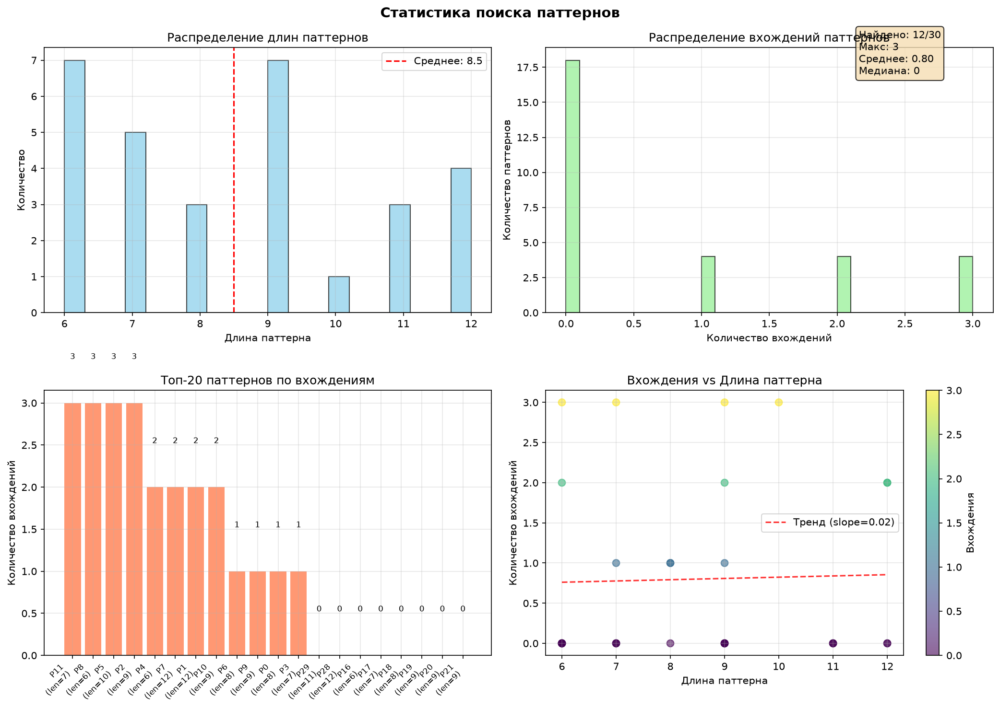
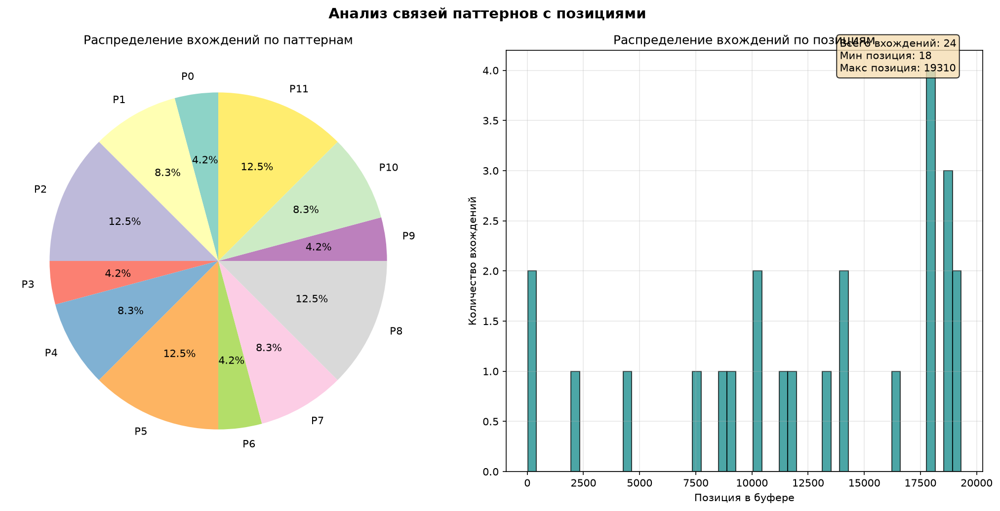
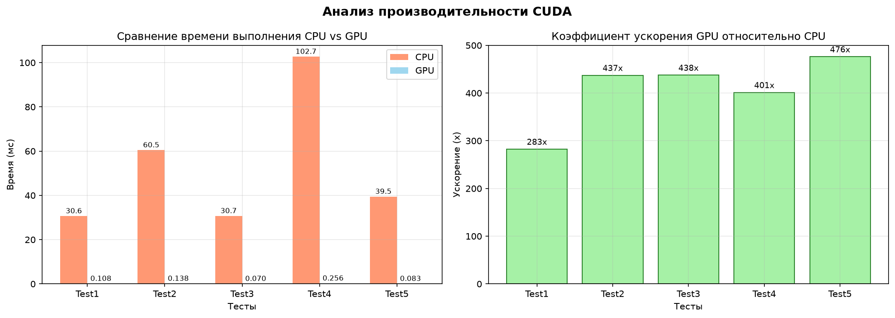

## Просьба о пощаде
- Я тупой человек, неведующий ни в линуксе ни в С++, который потерял все дедлайны. Мне нужно вколоть большой осиновый кол в самое интиимное место, чтобы больше не повторял такие гадости
- Я готов на все пути исправления ситуации лишь намекните

# Bilateral

Реализация билатерального фильтра для 8-битных grayscale изображений с использованием CUDA для ускорения на GPU. Проект включает CPU и GPU реализации для сравнения производительности и проверки корректности.

## 🎯 Описание

Билатеральный фильтр - это нелинейный фильтр, который сохраняет края изображения while удаляя шум. В отличие от обычного гауссовского размытия, билатеральный фильтр учитывает не только пространственное расстояние между пикселями, но и разницу в их интенсивности.

Этот проект демонстрирует:
- Реализацию билатерального фильтра на CPU (для валидации)
- Оптимизированную реализацию на GPU с использованием CUDA текстур
- Сравнение производительности CPU vs GPU
- Работу с BMP файлами (8-bit grayscale)

## ✨ Особенности

- 🚀 **Ускорение GPU**: Использование CUDA текстур для оптимального доступа к памяти
- 📊 **Сравнение производительности**: Автоматическое измерение времени выполнения на CPU и GPU
- ✅ **Валидация результатов**: Сравнение выходных изображений CPU и GPU
- 🖼️ **Поддержка BMP**: Встроенные функции для загрузки и сохранения 8-bit grayscale BMP
- ⚙️ **Настраиваемые параметры**: Возможность изменения sigma_d и sigma_r
- 📈 **Детальная статистика**: Вывод различий между CPU и GPU результатами

## ✨ Results
- [test_input.bmp](6131LobanovSS/bilateral/test_input.bmp)

- [result_gpu.bmp](6131LobanovSS/bilateral/result_gpu.bmp)

- [result_cpu.bmp](6131LobanovSS/bilateral/result_cpu.bmp)
# =================================================================================================================================

# 🔍 Mass Search
Высокопроизводительный поиск множественных подстрок в буфере данных с использованием **constant memory CUDA** и **атомарных операций**. Достигнуто ускорение до **543x** по сравнению с CPU реализацией.

## 📊 Ключевые результаты

| Тест | CPU (мс) | GPU (мс) | Ускорение | Результат |
|------|----------|----------|-----------|-----------|
| Стандартный | 30.15 | 0.055 | **543x** | ✅ |
| Увеличенный буфер | 60.78 | 0.145 | **418x** | ✅ |
| Режим факта | 30.50 | 0.061 | **500x** | ✅ |
| Короткие паттерны | 101.61 | 0.258 | **394x** | ✅ |
| Длинные паттерны | 39.17 | 0.124 | **315x** | ✅ |
| **Среднее** | - | - | **434x** | ✅ |

## 🚀 Особенности

- **Constant Memory оптимизация** - упаковка данных в 32-битные значения
- **Атомарные операции** - безопасное обновление счетчиков
- **Автоматическая верификация** - сравнение с CPU реализацией
- **Визуализация результатов** - тепловые карты, статистика, графики

## 📈 Визуализации

### Статистика поиска

### Диаграмма связей

### Производительность

